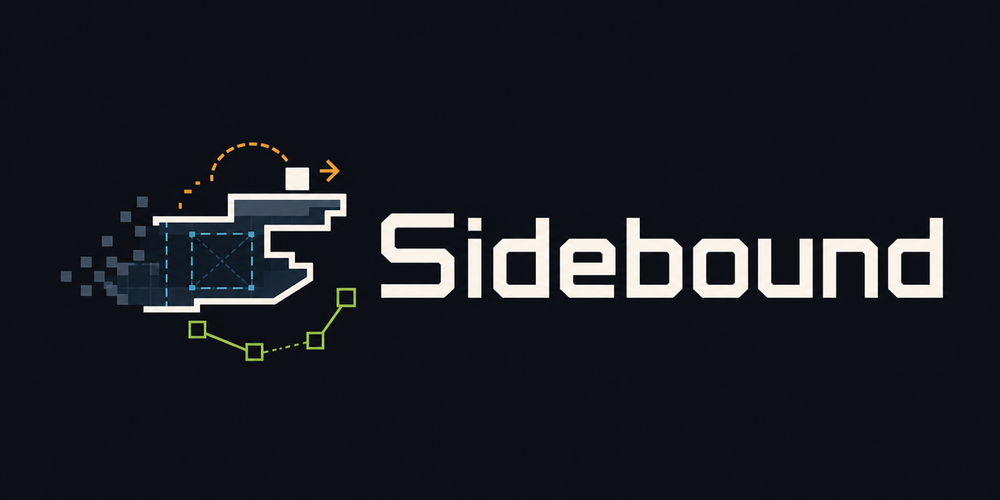

# Sidebound



## ALPHA ENGINE - EXPECT BREAKING CHANGES

> Sidebound is in an early alpha stage. The engine API, package layout, runtime,
> rendering layer, content model, and demo harness will change a lot.
>
> Most upcoming changes should be treated as breaking changes. The workspace is
> Deno-first and SDL3-first. Browser preview is temporary scaffolding while the
> SDL3 desktop runtime is built out.
>
> Use this repository as active engine research and development, not as a stable
> production dependency yet.

Sidebound is a code-first 2D side-view pixel-art engine for ARPG, roguelike,
and roguelite games. The project is engine-first: `packages/engine` is the
product, while `packages/game` is a demo and debugging harness used to validate
engine APIs. The SDL3 platform package isolates native runtime details from the
engine core while the temporary browser preview is retired.

The engine direction is Deno-first, SDL3-first, desktop-friendly, and built
around clean TypeScript files instead of an editor-only workflow. Browser
preview is temporary comparison scaffolding; gameplay, simulation, rendering
abstractions, audio, input, storage, and tooling should be portable outside the
browser.

## Focus

- Side-view-only physics, camera, collision, combat, lighting, and pathfinding.
- Interaction physics: push, ride, bounce, hook, stack, trigger, and knockback.
- Code-first content definitions for sprites, equipment, items, tiles, mobs, and
  players.
- Region, location, connection, and chunked-map architecture for clean large
  worlds.
- SDL3-first runtime and renderer; browser preview is temporary migration
  scaffolding.
- Debug visibility for rendering, physics, lighting, input, entities, and world
  travel.

## Workspace

- `packages/engine` - reusable Sidebound engine systems.
- `packages/game` - temporary demo/debug harness for engine refactoring.
- `packages/platform-browser` - temporary browser/canvas migration adapter to be deleted.
- `packages/platform-sdl` - SDL3 runtime adapter under migration.
- `agents` - project notes, roadmap, target engine API, and architecture docs.
- `assets/brand` - logo and repository visibility assets.

## Current Commands

```sh
mise install
mise run setup
mise exec -- deno task dev
mise exec -- deno task check
mise exec -- deno task build
mise exec -- deno task --cwd packages/platform-sdl check
mise exec -- deno task --cwd packages/platform-sdl dev
```

## Direction

The demo harness should stay small and artificial until the engine is strong
enough. Real game content, lore, progression, quests, and polished level design
come later; the immediate goal is a clean, testable engine with strong
debugging, validation, and platform boundaries.

New renderer work should target SDL3 and `Renderer2D`/texture commands. Browser
renderer code should only be touched to keep the temporary preview compiling
during the migration, then deleted after SDL3 debug-room parity.
